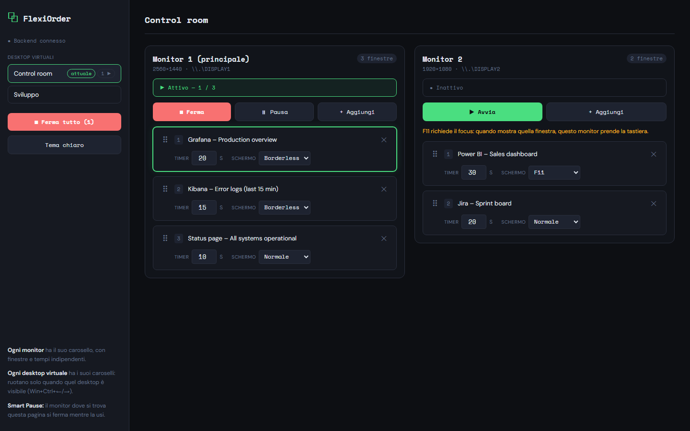
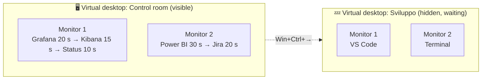
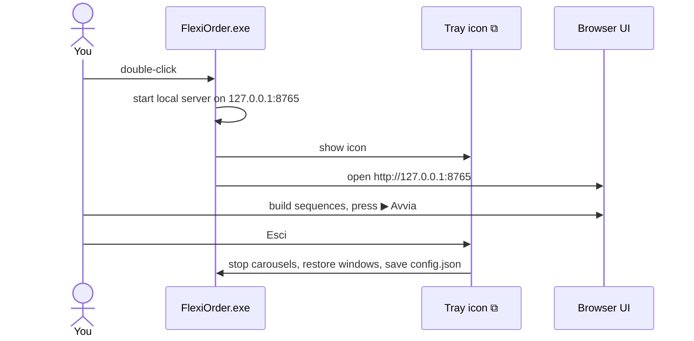
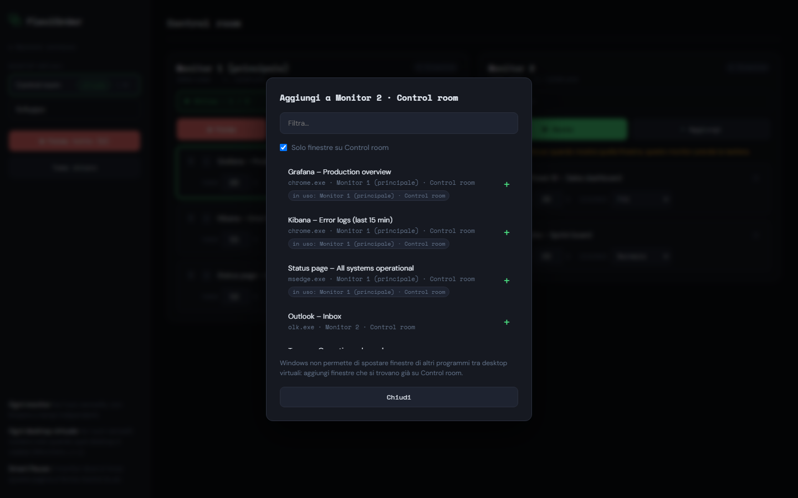
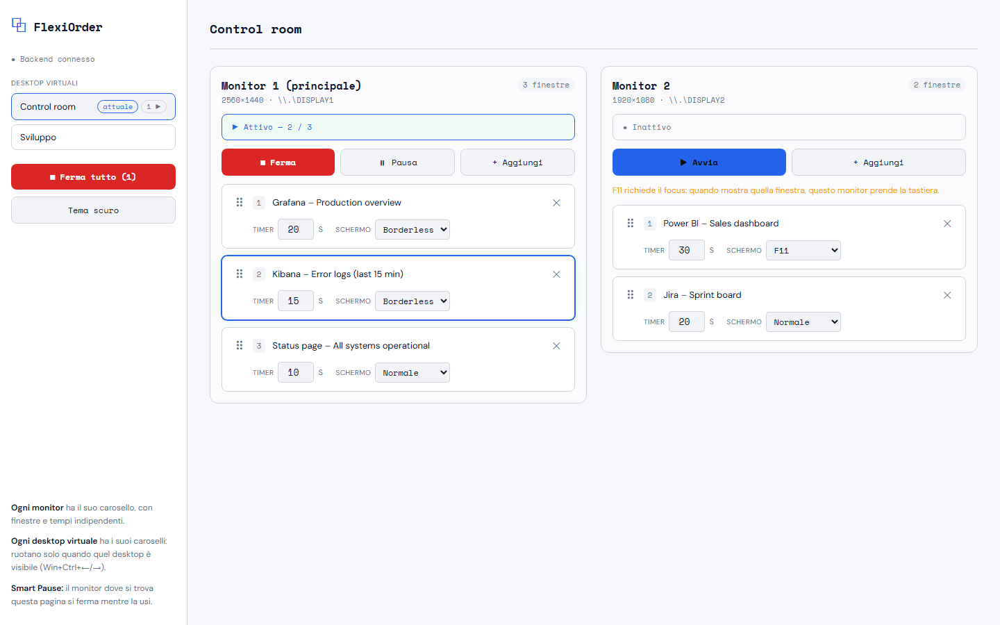
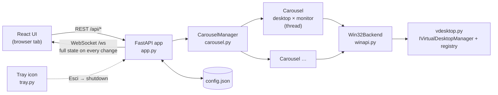

<p align="center">
  
</p>

<h1 align="center">FlexiOrder</h1>

<p align="center"><b>Window carousel for Windows</b>: one independent rotation per monitor, per virtual desktop.</p>

<p align="center">
  <a href="https://github.com/MGriot/flexiorder/releases/latest"></a>
  
  
  <a href="LICENSE"></a>
</p>

FlexiOrder rotates windows automatically: each window stays in front for its own timer, then the next one takes over. It's built for wall displays, control rooms, dashboards and kiosks, or any setup where several screens should cycle through windows on their own.

Every screen on every virtual desktop has its own windows, order, timers, and start/stop/pause. Download the **portable single-file exe** (no install) or run it from source.



## ✨ Features

- **Multi-monitor**: each monitor rotates on its own schedule. Windows are raised *without stealing focus*, so the screen you're working on keeps the keyboard. A window added to "Monitor 2" is moved onto Monitor 2.
- **Virtual desktops** (Win+Ctrl+D): each desktop keeps its own set of carousels. Only the desktop you're looking at rotates. The others wait and resume when you switch back.
- **Fullscreen per window**:
  - *Borderless*: removes the frame and fills the monitor. Works on any monitor, doesn't need focus. Restored when you stop or remove the window.
  - *F11*: the app's own fullscreen (browsers). Pressed only if the window isn't already fullscreen, and only when it really has focus.
- **Smart Pause**: the monitor showing the FlexiOrder page pauses while you use it. Other monitors keep going.
- **Persistent**: sequences are saved to `%APPDATA%\FlexiOrder\config.json` (the portable exe keeps them next to itself). After a restart, windows are re-linked by program + title. Closed windows show as "mancante" and re-link automatically when they reappear.
- **Zero-latency switching**: DWM transitions are disabled during each switch.
- **Portable**: a single exe with a tray icon, no installer and no Python needed.
- **Light and dark theme**, local only (`127.0.0.1`), no account and no telemetry.

### How the carousels are organised



Each box is its own carousel with its own thread. Only the carousels on the visible desktop rotate; the others resume when you switch back to their desktop.

---

## 🚀 Getting started

### Portable exe (no install)

Download `FlexiOrder-<version>-win64.exe` from the [GitHub Releases page](https://github.com/MGriot/flexiorder/releases) (or [build it](#-building-the-portable-exe)) and double-click it. It's one file with no installer and no Python needed. It runs on Windows 10/11 only, because everything FlexiOrder does goes through the Win32 API.

- There's no console window. A **⧉ tray icon** appears and the UI opens in your browser. Tray menu: **Apri FlexiOrder** (also on double-click) and **Esci**, which stops the carousels, restores borderless windows and saves.
- `config.json` and `flexiorder.log` are written **next to the exe**, so you can carry it on a USB stick. If that folder isn't writable (e.g. Program Files), the config goes to `%APPDATA%\FlexiOrder\` instead.
- The build is unsigned, so on first launch SmartScreen may say "Windows protected your PC". Click **More info → Run anyway**.
- Launching it again while it's running just opens the UI.



### From source

Prerequisites: Windows 10/11, Python 3.11+ (tested on 3.14). Node.js 18+ is only needed to rebuild the UI.

```bash
python -m venv .venv
.venv\Scripts\activate
pip install -r backend/requirements.txt
python run.py
```

This starts the server on <http://127.0.0.1:8765> and opens the browser. Options:

| Flag | Meaning |
|---|---|
| `--port N` | preferred port (falls back to the next free one if taken or reserved) |
| `--no-browser` | don't open the UI |
| `--tray` | run in the background with a tray icon (always on in the exe) |

Running `python run.py` again while it's already running just opens the UI; it won't start a second backend.

The server listens on **127.0.0.1 only**, because this API can move every window on the machine.

### Rebuilding the UI (after editing `frontend/`)

```bash
cd frontend
npm install
npm run build
```

The build lands in `backend/static/`. For live-reload development, run `npm run dev` (http://localhost:5173) while `python run.py` is running. Vite proxies `/api` and `/ws` to port 8765 (override with `FLEXIORDER_PORT`).

### 📦 Building the portable exe

```bash
pip install -r backend/requirements-build.txt
python packaging/build.py          # add --ui to rebuild the React UI first (needs Node.js)
```

This produces `dist/FlexiOrder-<version>-win64.exe` (PyInstaller, single file). Pushing a `v*` tag runs `.github/workflows/release.yml`, which tests, builds, and attaches the exe to the GitHub Release.

---

## 🛠️ Using it

1. Pick a **virtual desktop** in the sidebar ("attuale" marks the one you're on).
2. Each **monitor** is a column. Click **+ Aggiungi** to add windows. By default the picker lists windows on the selected desktop and shows each window's current monitor. Windows already used by another carousel are tagged *in uso*.

   

3. Drag cards (⠿) to reorder. Set the **Timer** (seconds) and the **Schermo** mode:

   | Schermo | What happens | Needs focus |
   |---|---|---|
   | **Normale** | the window is raised as it is | no |
   | **Borderless** | frame removed, fills the monitor, restored on stop | no |
   | **F11** | presses the app's own fullscreen key (browsers) | yes |

4. Press **▶ Avvia** on each monitor you want rotating. Use **⏸ Pausa** / **■ Ferma** per monitor, or **Ferma tutto**. The active window is highlighted, and the status bar shows its position (e.g. *Attivo – 2 / 3*).
5. Switch to the light theme with **Tema chiaro** in the sidebar.

<p align="center">
  
</p>

### Limitations (by design of Windows)

- **Switching desktops is up to you.** Windows' only public API for moving windows between virtual desktops works on the caller's own windows. So add windows that already live on that desktop. FlexiOrder never shows a window from another desktop, because activating it would make Windows jump desktops.
- **F11 needs keyboard focus.** A monitor showing an F11 window takes the keyboard at that moment. Use *Borderless* if several monitors rotate at once.
- Elevated (admin) windows can't be controlled from a non-elevated FlexiOrder.

---

## 🧪 Testing

```bash
pip install -r backend/requirements-dev.txt
cd backend
python -m pytest tests            # fast, OS-independent logic tests
python tools/diag.py              # what FlexiOrder sees: monitors, desktops, windows
python tools/demo.py              # the real UI on fake windows: http://127.0.0.1:8790
```

`tools/demo.py` runs the real API and UI on an in-memory backend with two fake monitors, two virtual desktops and sample dashboards. It never touches your windows, so it's handy for trying the UI and for the README screenshots.

Live Win32 tests briefly open small test windows. Enable them with an environment variable (cmd: `set FLEXIORDER_LIVE=1`, PowerShell: `$env:FLEXIORDER_LIVE="1"`), then run `python -m pytest tests` again. The multi-monitor live test runs automatically when 2+ monitors are connected.

---

## 🩺 Troubleshooting

| Symptom | Cause / fix |
|---|---|
| `Port 8765 is unavailable, using …` | Normal: the port is taken or reserved by Windows (Hyper-V/WSL reserve ranges; see `netsh interface ipv4 show excludedportrange protocol=tcp`). The UI opens on the port printed. |
| A monitor shows "Nessuna finestra disponibile" | Every window in that sequence is closed, minimized to another desktop, or on a different virtual desktop. Closed windows re-link automatically when reopened with the same program and title. |
| Smart Pause doesn't trigger | Keep the FlexiOrder tab active in its browser window: the backend recognizes it by the `FlexiOrder #…` page title. |
| The exe starts but nothing happens | Look at `flexiorder.log` next to the exe (or in `%APPDATA%\FlexiOrder\`): startup errors land there because the exe has no console. |
| SmartScreen or an antivirus blocks the exe | The build is unsigned and PyInstaller exes are sometimes flagged as a false positive. Use **More info → Run anyway**, allow it in your antivirus, or build it yourself / run from source. |
| A window ignores the carousel | It's probably running as administrator. Run FlexiOrder elevated too, or leave that window out. |
| Picker doesn't list a window from another desktop | Untick "Solo finestre su …", but remember that window can only rotate on its own desktop. |

---

## 📖 Architecture

```text
flexiorder/
├── run.py                     # one-command launcher (also the exe's entry point)
├── packaging/build.py         # builds the portable exe
├── backend/
│   ├── main.py                # legacy entry point (python main.py)
│   ├── flexiorder/
│   │   ├── app.py             # FastAPI routes, WebSocket state push, watcher, persistence glue
│   │   ├── carousel.py        # Carousel (one thread per desktop×monitor) + CarouselManager
│   │   ├── winapi.py          # Win32Backend: enumerate, raise/focus, borderless, F11, monitors
│   │   ├── tray.py            # system-tray icon (portable exe / --tray)
│   │   ├── vdesktop.py        # virtual desktops (IVirtualDesktopManager + registry, read-only)
│   │   └── config.py          # %APPDATA% config + window re-matching
│   ├── static/                # built UI
│   ├── tests/                 # pytest (fake backend + opt-in live tests)
│   └── tools/                 # diag.py (what the backend sees), demo.py (fake-window demo)
├── frontend/src/App.jsx       # React UI (one column per monitor, dnd-kit)
├── docs/images/               # README screenshots and icon
└── .github/workflows/         # release.yml: test + build + attach exe on v* tags
```



The carousel logic talks to the OS only through the small `WindowBackend` protocol in `carousel.py`. The tests swap in a fake, so scheduling, pausing and desktop gating are tested without real windows.

### API

| Method | Path | Body | Description |
|---|---|---|---|
| `GET` | `/api/state` | | desktops, current desktop, monitors, all carousels |
| `GET` | `/api/windows` | | windows with exe, monitor, desktop, minimized |
| `PUT` | `/api/carousel/sequence` | `{desktop, monitor, items[]}` | set one carousel's sequence |
| `POST` | `/api/carousel/{start\|stop\|pause\|resume}` | `{desktop, monitor}` | control one carousel |
| `POST` | `/api/stop-all` | | stop every carousel |
| `POST` | `/api/self` | `{token}` | register the UI tab (its title contains `FlexiOrder #token`) |
| `WS` | `/ws` | | full state pushed on every change |

`items[]`: `{id?, hwnd, title, exe, timer (1–3600 s), mode: "none"|"borderless"|"f11"}`.

### How switching works

- **Without focus** (default when you're working on another monitor): `SetWindowPos(HWND_TOPMOST)` then `HWND_NOTOPMOST` with `SWP_NOACTIVATE`. The window comes to the top of the z-order and nobody's keyboard focus changes.
- **With focus** (the foreground window is already on that monitor, or F11 is needed): `AttachThreadInput` to the foreground thread, then `SetForegroundWindow`. If Windows' anti-focus-stealing rule blocks it, a synthetic ALT double-tap counts as user input and the call is retried.
- **Current virtual desktop**: read from the registry when Windows writes it. Otherwise it's inferred from which desktop the windows reported by `IsWindowOnCurrentVirtualDesktop` belong to.
- The process is per-monitor DPI aware, so coordinates are correct on scaled monitors.
